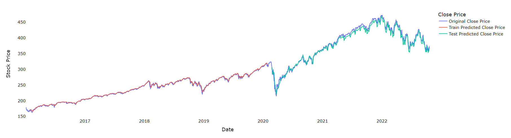
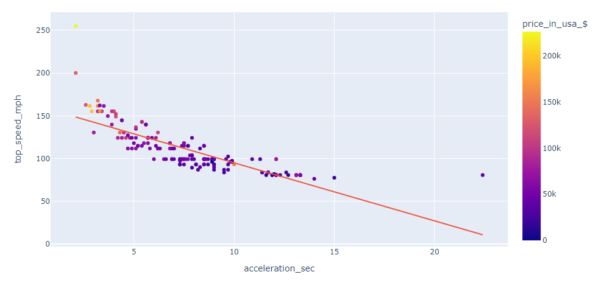
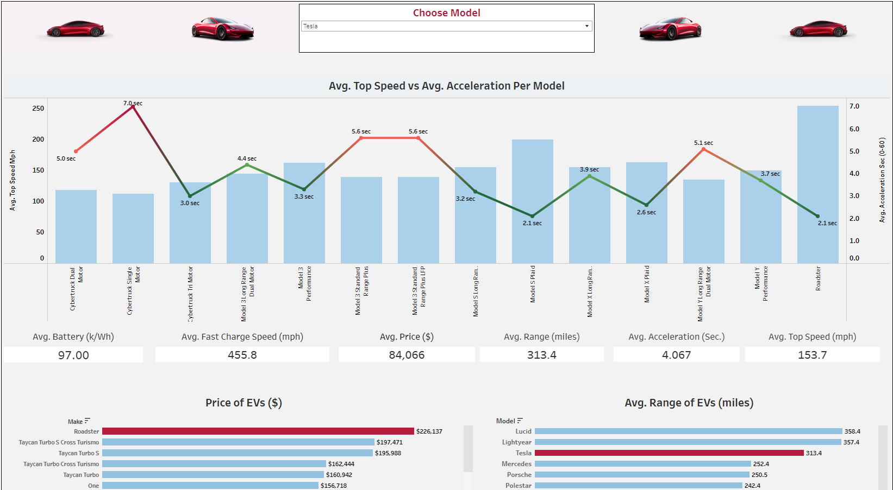
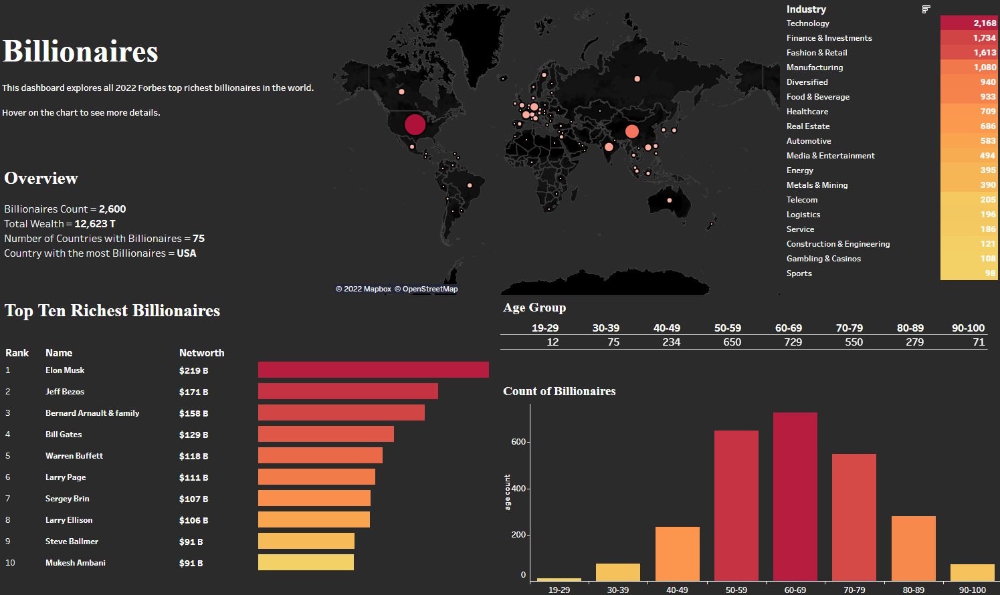

# Data Analytics Portfolio
## [Project 1: Book Recommender (Python and ML)](https://github.com/leon-arie/leon-arie.github.io/blob/main/Book%20Recommender%20.ipynb)

### Purpose: 
Trying to find new books to read takes time and energy. For this project, I created a book recommender system to give suggestions on what to read next.
### Summary:
1. Cleaned book dataset.
2. Created a function that uses CountVectorization and Cosine Similarity from scikit-learn to find similarities between user input and books.
3. Model suggested book recommendations.

## [Project 2: SPY Price Prediction (Python and ML)](https://colab.research.google.com/drive/1Gmp1BhKa1sykX7BmyAPSkm95zFsrmTYY?usp=sharing)

### Purpose: 
Is it possible to predict stock prices? In this project, I try to use LTSM to model the future price of an ETF.
### Summary:
1. Load in past prices of SPY from Yahoo Finance.
2. Created LTSM model and train data.
3. Predicted the future price of SPY.
4. Checked training and validation loss.
5. Graphed results. 

## [Project 3: EV Dataset Analysis (Python, Data Cleaning, and EDA)](https://github.com/leon-arie/leon-arie.github.io/blob/main/python/EV%20Analysis.ipynb)

### Purpose: 
In this project, I use **Python** to compare key metrics between different electric vehicles to find valuable information that will help lead to future buying decisions.
### Summary:
1. Cleaned dataset to prepare for analysis.
2. Exploratory data analysis.
3. Found a correlation between key metrics.
4. Analyzed if higher prices determine higher performance for an EV.

## [Project 4: EV Comparison Tableau Dashboard (Tableau)](https://public.tableau.com/app/profile/leon.arie/viz/EVDashboard_16550801177210/CarDashboard) 

### Purpose: 
In project 4, I took the cleaned dataset in project 3 and create a Tableau dashboard to compare different car performances based on models.  

### Summary:
1. Load EV dataset into **Tableau**.
2. Created bar graphs and tables to compare performance metrics for different cars.
4. Added a filter for each car model to quickly view EV stats.

## [Project 5: Forbes 2022 Billionaires Tableau Dashboard (Tableau)](https://public.tableau.com/app/profile/leon.arie/viz/Billionaires_16552642324310/Dashboard1) 

### Purpose:
Analyze demographic information on the top Forbes 2022 billionaires around the world and create an interactive Tableau dashboard.

### Summary:
1. Cleaned the dataset and load it into **Tableau**.
3. Created a Tableau dashboard with different demographic data to further analyze the top billionaires.
